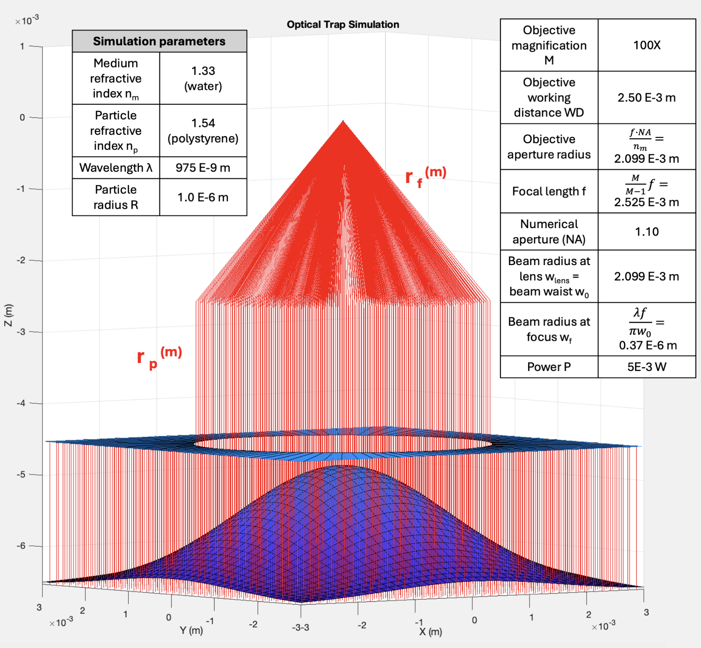

## Optical Tweezers Simulation and Visualization Code

Work for 3rd Year Project at the University of Oxford. See [technical report](https://drive.google.com/file/d/1BIRRtONjwTGZrLBfp1KXKSUdhQDJR_-3/view?usp=sharing) for details. See also [optical tweezers geometrical optics](http://opticaltweezers.org/software/otgo-optical-tweezers-geometrical-optics/).

